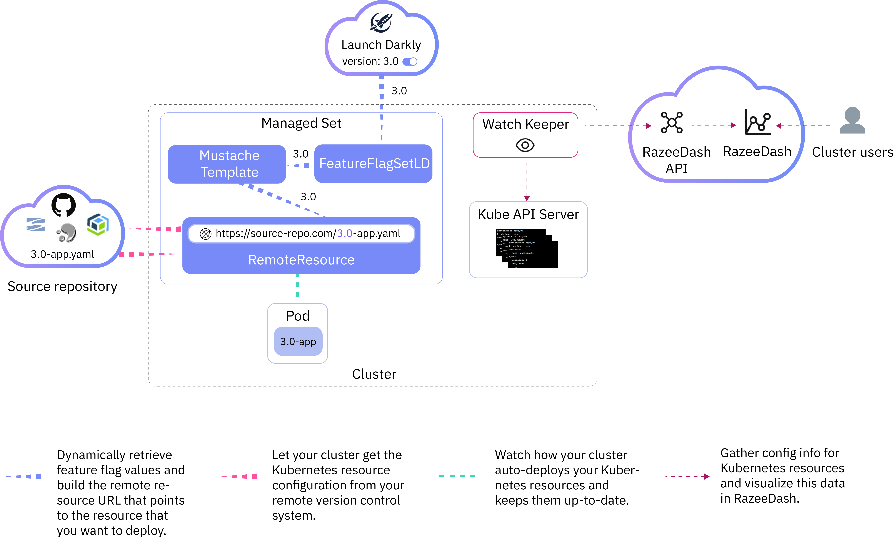

[Razee](http://www.razee.io/) is an open-source project that was developed by IBM to automate and manage the deployment of Kubernetes resources across clusters, environments, and cloud providers, and to visualize deployment information for your resources so that you can monitor the rollout process and find deployment issues more quickly.

See the following links to get started with Razee:

- [Architecture overview](#architecture-overview)
  - [RazeeDash components](#razeedash-components)
  - [Kapitan components](#kapitan-components)
- [Prerequisites](#prerequisites)
- [Step 1: Install Razee](#step-1-install-razee)
- [Step 2: Visualize deployment information in RazeeDash](#step-2-visualize-deployment-information-in-razeedash)
- [Step 3: Automatically deploy Kubernetes resources with RemoteResources](#step-3-automatically-deploy-kubernetes-resources-with-remoteresources)
- [Step 4: Add version control or replace YAML file variables with MustacheTemplates](#step-4-add-version-control-or-replace-yaml-file-variables-with-mustachetemplates)
- [Step 5: Control deployments with FeatureFlagSetsLD](#step-5-control-deployments-with-featureflagsetsld)
- [Step 6: Organize resources in a ManagedSet](#step-6-organize-resources-in-a-managedset)
- [Stay connected](#stay-connected)
- [License](#license)

## Architecture overview

Razee consists of two modules, RazeeDash and Kapitan, that are loosely coupled and that can be used independently. With RazeeDash, you can dynamically create a live inventory of your Kubernetes resources and use the powerful filter and alerting capabilities to visualize configuration information and troubleshoot issues in your deployment process more quickly. Kapitan components are designed to simplify multi-cluster deployments by templatizing Kubernetes resources, grouping resources and clusters, and defining rules for these groupings so that you can create a flexible configuration that is enforced across clusters, environments, and clouds.

Take a look at the Razee architecture to see how Razee components interact, and how you can visualize and control your deployment process.



### RazeeDash components

<table>
   <thead>
      <th>Component</th>
      <th>Description</th>
   </thead>
   <tbody>
      <tr>
         <td><a href="https://github.com/razee-io/watch-keeper">Watch Keeper</a></td>
         <td>Watch Keeper is responsible to retrieve configuration information for Kubernetes resources and to send this data to the RazeeDash API. To use Watch Keeper, simply install this component in your cluster and add the <code>razee/watch-resource</code> label to all resources that you want to monitor. After you add the label, Watch Keeper retrieves configuration information from the Kubernetes API server and immediately sends this data to the RazeeDash API. This process repeats once every hour. In addition, Watch Keeper adds a Kubernetes event watcher to your resource so that Watch Keeper is notified by Kubernetes when the configuration of your resource changes. </td>
      </tr>
      <tr>
         <td><a href="https://github.com/razee-io/razeedash-api">RazeeDash API</a></td>
         <td>RazeeDash API is a service that receives Kubernetes resource configurations and resource definitions from Watch Keeper. Data that is sent to the RazeeDash API is automatically stored in MongoDB.  </td>
      </tr>
      <tr>
         <td><a href="https://github.com/razee-io/razeedash">RazeeDash</a></td>
         <td>RazeeDash visualizes data that is retrieved by Watch Keeper and dynamically creates an inventory of your Kubernetes resources in your cluster. You can use the intelligent filter and alerting capabilities to analyze this data and quickly identify and resolve issues in your deployment process. </td>
      </tr>
   </tbody>
</table>

### Kapitan components

<table>
   <thead>
      <th>Component</th>
      <th>Description</th>
   </thead>
   <tbody>
      <tr>
         <td><a href="https://github.com/razee-io/Kapitan-core">Kapitan Core</a></td>
         <td>Kapitan Core is a Continuous Delivery tool that runs in your cluster and that you can use to set up the <code>CustomResourceDefinitions</code> (CRD), Kubernetes controllers, and dependencies for the Kapitan components. </td>
      </tr>
      <tr>
         <td><a href="https://github.com/razee-io/Kapitan-delta">Kapitan Delta</a></td>
         <td>Kapitan Delta is a component of Kapitan Core that runs in your cluster and keeps the custom resource definitions and Kubernetes controllers of the Kapitan components up-to-date. </td>
      </tr>
      <tr>
         <td><a href="https://github.com/razee-io/RemoteResource">RemoteResource</a> and <a href="https://github.com/razee-io/RemoteResourceS3">Remote Resource S3</a></td>
         <td>RemoteResource and RemoteResourceS3 are custom resource definitions and controllers that you can use to automatically deploy Kubernetes resources that are stored in a source repository. Rather than manually applying these YAML files in each cluster, environment, or across clouds every time an update is made, simply define the source repository in your remote resource and create the remote resource in your cluster. The remote resource controller automatically connects to your source repository, downloads the Kubernetes configuration file and applies the file to your cluster. </td>
      </tr>
      <tr>
         <td><a href="https://github.com/razee-io/MustacheTemplate">MustacheTemplate</a></td>
         <td>MustacheTemplate is a custom resource definition and controller to define environment variables that you can use to replace YAML file pieces in other Kubernetes YAML files. For example, use the environment variables of your mustache template to build the URL for your remote resource so that you can point to the app version that you want to deploy. </td>
      </tr>
      <tr>
         <td><a href="https://github.com/razee-io/FeatureFlagSetLD">FeatureFlagSetLD</a></td>
         <td>FeatureFlagSetLD is a custom resource definition and controller to automatically retrieve feature flag values from <a href="https://launchdarkly.com">Launch Darkly</a>. With feature flags, you can control what code is deployed to your cluster and manage multiple versions of Kubernetes resources across clusters, environments, or clouds. </td>
      </tr>
      <tr>
         <td><a href="https://github.com/razee-io/ManagedSet">ManagedSet</a></td>
         <td>ManagedSet is a custom resource definition and controller to group Kubernetes resources that you want to create and apply to the cluster at the same time.  </td>
      </tr>
      <tr>
         <td><a href="https://github.com/razee-io/Kubernetes-util">Kubernetes utilities</a></td>
        <td>Kubernetes utilities is an <code>npm</code> package that you can use to simplify the communication with Kubernetes. </td>
      </tr>
   </tbody>
</table>

## Prerequisites

To deploy Razee in your cluster, your cluster must meet the following requirements:

- Your cluster must run Kubernetes version 1.11 or later.
- Your cluster have at least two worker nodes.
- Your cluster must be set up with public network access.

## Step 1: Install Razee

1. Install Kapitan in your cluster. Kapitan automatically creates the Kubernetes `CustomResourceDefinitions` (CRD) and controllers for each Kapitan component, the `razee` namespace, service account, and RBAC roles and role bindings in your cluster.

   ```bash
   kubectl apply -f https://github.com/razee-io/Kapitan-delta/releases/latest/download/resource.yaml
   ```

   Example output:

   ```
   namespace/razee configured
   serviceaccount/kapitan-sa configured
   clusterrole.rbac.authorization.k8s.io/cluster-admin configured
   clusterrolebinding.rbac.authorization.k8s.io/kapitan-rb configured
   configmap/kapitan-delta-resource-uris configured
   deployment.apps/kapitan-delta configured
   ```

2. Verify that the Kapitan components are deployed successfully. You must see one pod per component and each pod must be in a `Running` state before you proceed with the next step.

   ```bash
   kubectl get pods -n razee
   ```

   Example output:

   ```
   NAME                                           READY   STATUS    RESTARTS   AGE
   featureflagsetld-controller-86d8785864-x84ld   1/1     Running   0          34s
   kapitan-delta-d7996c95d-dlz6x                  1/1     Running   0          60s
   managedset-controller-575f4864b8-xvgxz         1/1     Running   0          33s
   mustachetemplate-controller-847d66c6bd-j8p7d   1/1     Running   0          31s
   remoteresource-controller-6896c55cd9-nckqw     1/1     Running   0          30s
   remoteresources3-controller-86669655f9-5qv5m   1/1     Running   0          30s
   ```

3. Install the RazeeDash components in your cluster.

   ```bash
   kubectl apply -f https://github.com/razee-io/Razee/releases/latest/download/resource.yaml
   ```

   Example output:

   ```
   persistentvolume/mongo-pv-volume created
   persistentvolumeclaim/mongo-pv-claim created
   deployment.apps/mongo created
   service/mongo created
   secret/razeedash-secret created
   remoteresource.kapitan.razee.io/razeedash created
   service/razeedash-lb created
   service/razeedash-api-lb created
   ```

4. Wait for the `razeedash-api` deployment to complete. As part of the RazeeDash API setup, an instance of MongoDB is created in your cluster and connected to your RazeeDash API instance. The setup of MongoDB takes a couple of minutes to complete and might lead to intermittent `MongoNetworkError` errors in your RazeeDash API deployment. When MongoDB is fully set up, Kubernetes automatically finishes the setup of your RazeeDash API instance.

   ```bash
   kubectl logs deploy/razeedash-api -n razee
   ```

   Example output if MongoDB is not yet setup:

   ```
   > razeedash-api@0.0.1 start /usr/src
   > node app/index.js

   (node:16) UnhandledPromiseRejectionWarning: MongoNetworkError: getaddrinfo ENOTFOUND mongo
    at Socket.<anonymous> (/usr/src/node_modules/mongodb-core/lib/connection/connect.js:287:16)
    at Object.onceWrapper (events.js:284:20)
    at Socket.emit (events.js:196:13)
    at emitErrorNT (internal/streams/destroy.js:91:8)
    at emitErrorAndCloseNT (internal/streams/destroy.js:59:3)
    at processTicksAndRejections (internal/process/task_queues.js:84:9)
   (node:16) UnhandledPromiseRejectionWarning: Unhandled promise rejection. This error originated either by throwing inside of an async function without a catch block, or by rejecting a promise which was not handled with .catch(). (rejection id: 1)
   (node:16) [DEP0018] DeprecationWarning: Unhandled promise rejections are deprecated. In the future, promise rejections that are not handled will terminate the Node.js process with a non-zero exit code.
   ```

   Example output if RazeeDash API is fully set up:

   ```
   > razeedash-api@0.0.1 start /usr/src
   > node app/index.js

   {"name":"/","parseUA":false,"excludes":["req-headers","res-headers","referer","url","body","short-body"],"hostname":"razeedash-api-55fd67ddb9-cnbf4","pid":16,"level":30,"msg":"Created new collection deployments index deployments","time":"2019-05-22T03:15:11.526Z","v":0}
   {"name":"/","parseUA":false,"excludes":["req-headers","res-headers","referer","url","body","short-body"],"hostname":"razeedash-api-55fd67ddb9-cnbf4","pid":16,"level":30,"msg":"Created new collection resources index resources","time":"2019-05-22T03:15:11.528Z","v":0}
   {"name":"/","parseUA":false,"excludes":["req-headers","res-headers","referer","url","body","short-body"],"hostname":"razeedash-api-55fd67ddb9-cnbf4","pid":16,"level":30,"msg":"Created new collection clusters index clusters","time":"2019-05-22T03:15:12.172Z","v":0}
   {"name":"/","parseUA":false,"excludes":["req-headers","res-headers","referer","url","body","short-body"],"hostname":"razeedash-api-55fd67ddb9-cnbf4","pid":16,"level":30,"msg":"Created new collection orgs index orgs","time":"2019-05-22T03:15:12.172Z","v":0}
   {"name":"/","parseUA":false,"excludes":["req-headers","res-headers","referer","url","body","short-body"],"hostname":"razeedash-api-55fd67ddb9-cnbf4","pid":16,"level":30,"msg":"Created new collection resourceStats index resourceStats","time":"2019-05-22T03:15:12.173Z","v":0}
   {"name":"/","parseUA":false,"excludes":["req-headers","res-headers","referer","url","body","short-body"],"hostname":"razeedash-api-55fd67ddb9-cnbf4","pid":16,"level":30,"msg":"Created new collection messages index messages","time":"2019-05-22T03:15:14.253Z","v":0}
   {"name":"razeedash-api","hostname":"razeedash-api-55fd67ddb9-cnbf4","pid":16,"level":30,"msg":"razeedash-api listening on port 3333","time":"2019-05-22T03:15:14.257Z","v":0}
   ```

5. Retrieve the **EXTERNAL-IP** of your `razeedash-lb` and `razeedash-api-lb` load balancer services and create a RazeeDash config map. The two load balancer services are automatically created during the setup of your RazeeDash API instance and assigned a public IP address. `razeedash-lb` serves as the public endpoint for your RazeeDash instance, and `razeedash-api-lb` serves as the public endpoint for your RazeeDash API instance. RazeeDash config map includes the public IP addresses for your RazeeDash and RazeeDash API instances. This config map is required to finish the setup of RazeeDash. You can execute the following Bash commands or execute [bin/kc_create_razeedash_config.sh](https://github.com/razee-io/Kube-cloud-scripts/blob/master/bin/kc_create_razeedash_config_map.sh)
  * note the required trailing '/' at the end of `root_url` and `razeedash_api_url`

   ```bash
   RAZEEDASH_LB=$(kubectl get service razeedash-lb -n razee -o jsonpath="{.status.loadBalancer.ingress[*].ip}")
   RAZEEDASH_API_LB=$(kubectl get service razeedash-api-lb -n razee -o jsonpath="{.status.loadBalancer.ingress[*].ip}")
   kubectl create configmap razeedash-config -n razee \
     --from-literal=root_url=http://"${RAZEEDASH_LB}":8080/ \
     --from-literal=razeedash_api_url=http://"${RAZEEDASH_API_LB}":8081/
   ```

6. Verify that all Razee components are deployed and show `1/1` in the **READY** column of your CLI output.

   ```bash
   kubectl get deployments -n razee
   ```

   Example output:

   ```
   NAME                          READY   UP-TO-DATE   AVAILABLE   AGE
   featureflagsetld-controller   1/1     1            1           8d
   kapitan-delta                 1/1     1            1           8d
   managedset-controller         1/1     1            1           8d
   mongo                         1/1     1            1           75m
   mustachetemplate-controller   1/1     1            1           8d
   razeedash                     1/1     1            1           75m
   razeedash-api                 1/1     1            1           75m
   remoteresource-controller     1/1     1            1           76m
   remoteresources3-controller   1/1     1            1           8d
   ```

7. In your preferred web browser, access the welcome screen of your RazeeDash instance.

   ```
   http://<razeedash-lb_external_IP>:8080
   ```

8. Register RazeeDash as an `OAuth` application in GitHub.
   1. From the RazeeDash welcome screen, click **Sign in**.
   2. Click **Configure GitHub Login**. A pop-up window opens.
   3. Follow the [link](https://github.com/settings/applications/new) in the pop-up window to register a new `OAuth` application in GitHub. Enter a name for your GitHub application, a description, and the **Homepage URL** and **Authorization callback URL** that are displayed in the pop-up window.
   4. Click **Register application**.
   5. Copy the **Client ID** and the **Client Secret** and add these values to the pop-up window.
   6. Click **Save configuration**.

9. Grant RazeeDash access to your organization in GitHub.
    1. If you do not own a GitHub organization, [create one](https://help.github.com/en/articles/creating-a-new-organization-from-scratch).
    2. From the RazeeDash welcome screen, click **Sign in with GitHub**. A pop-up window opens.
    3. In the **Organization access** section, find your organization and click **Grant**.
    4. Click **Authorize <github_user_name>**. The RazeeDash console opens and shows the name of the organization that you granted access to.

10. Install Watch Keeper in your cluster.
    1. From the RazeeDash console, click the **Register** button that you can find next to your GitHub organization.
    2. Click the **Manage** button.
    3. Copy the **Install Razee Agent** `kubectl` command.
    4. Run the command in your cluster to create the Watch Keeper component.

       ```bash
       kubectl create -f http://<razeedash-api-lb_external_IP>:8081/api/install/cluster?orgKey=orgApiKey-<org_api_key>
       ```

       Example output:

       ```
       configmap/watch-keeper-config created
       secret/watch-keeper-secret created
       clusterrole.rbac.authorization.k8s.io/cluster-reader created
       serviceaccount/watch-keeper-sa created
       clusterrolebinding.rbac.authorization.k8s.io/watch-keeper-rb created
       networkpolicy.networking.k8s.io/watch-keeper-deny-ingress created
       deployment.apps/watch-keeper created
       Error from server (AlreadyExists): namespaces "razee" already exists
       ```

    5. Wait for Watch Keeper to finish.

       ```bash
       kubectl get deployment -n razee | grep watch-keeper
       ```

       Example output:

       ```
       watch-keeper                  1/1     1            1           2m5s
       ```

11. From the RazeeDash console, click **Launch** to open the RazeeDash details page and verify that you can see deployment information for your Watch Keeper pod.

## Step 2: Visualize deployment information in RazeeDash

With Watch Keeper set up in your cluster, you can retrieve deployment information for other Kubernetes resources that you want to monitor. Data is automatically sent to the RazeeDash API and you can access, monitor, and analyze this data with RazeeDash.

1. Decide what information you want Watch Keeper to retrieve by choosing between the following information detail levels: <ul><li><code>lite</code>: Retrieves the <code>metadata</code> and <code>status</code> section of your Kubernetes resource configuration. </li><li><code>detail</code>: Retrieves all configuration data of a Kubernetes resource, but leaves out environment variables and the <code>data</code> section of config maps and secrets.</li><li><code>debug</code>: Retrieves all configuration data of a Kubernetes resource, including environment variables and the <code>data</code> section of config maps and secrets. This information might include sensitive information so use this option with care. </li></ul>

2. Add the `razee/watch-resource` label to the **labels** section of all Kubernetes resources that you want to monitor and specify the information detail level. For example, if you want to monitor a Kubernetes deployment, use the following command. After you add the label to your resource, Watch Keeper automatically scans your resource and sends data to the RazeeDash API. Then, your resource is scanned once every hour. In addition, Watch Keeper adds a Kubernetes event watcher to your resource so that Watch Keeper is notified by Kubernetes when the configuration of your resource changes.

   ```bash
   kubectl edit deployment <deployment_name>
   ```

   Example YAML file:

   ```yaml
   apiVersion: extensions/v1beta1
   kind: Deployment
   metadata:
     annotations:
       deployment.kubernetes.io/revision: "1"
       kubectl.kubernetes.io/last-applied-configuration: |
      {"apiVersion":"apps/v1","kind":"Deployment","metadata":{"annotations":{},"labels":{"app":"myapp"},"name":"expandpvc","namespace":"default"},"spec":{"selector":{"matchLabels":{"app":"myapp"}},"template":{"metadata":{"labels":{"app":"myapp"}},"spec":{"containers":[{"image":"nginx","name":"expandpvc","volumeMounts":[{"mountPath":"/test","name":"myvol"}]}],"volumes":[{"name":"myvol","persistentVolumeClaim":{"claimName":"expandpvc"}}]}}}}
     creationTimestamp: "2019-04-30T15:31:24Z"
     generation: 1
     labels:
       app: myapp
       razee/watch-resource: "lite"
   ...
   ```

3. In your preferred web browser, open RazeeDash. To find the public IP address that is assigned to your RazeeDash service, run `kubectl get service razeedash-lb -n razee`.

   ```
   http://<razeedash-lb_external_IP>:8080
   ```

4. Access your data.
   1. Click **Sign in**.
   2. Click **Sign in with GitHub**.
   3. Find the GitHub organization that you connected RazeeDash to and click **Launch** to open the RazeeDash console.

5. OPTIONAL: As you'll notice in the Razee dashboard, clusters you have configured to be watched and reported on are listed using a long ID token like `8e13917c-7e6b-11e9-a7d0-9e237586b5f9`. Razee can be configured to display the clusters using a more human-readable value versus the IDs by creating a ConfigMap in your target cluster and labelling it with `razee/cluster-metadata=true`.

   For example:

    ```
    apiVersion: v1
    data:
      name: razee-1
    kind: ConfigMap
    metadata:
      labels:
        razee/cluster-metadata: "true"
        razee/watch-resource: debug
      name: razee1-cluster-metadata
      namespace: default
    ````

    After the ConfigMap is picked up (within a few moments), Razee will display this cluster on the dashboard using `razee-1` instead of the long ID value seen before. Note that it may take about a minute before the change can be seen in the dashboard.

## Step 3: Automatically deploy Kubernetes resources with RemoteResources

RemoteResource and RemoteResourceS3 are Kapitan components that you can use to automatically deploy Kubernetes resources that are stored in a source repository. Simply define the source repository in your remote resource and create the remote resource in your cluster. The remote resource controller automatically connects to your source repository, downloads the Kubernetes configuration file, and applies the file to your cluster. This process repeats about every two minutes. All you have to do is to keep your source file up-to-date and let your cluster auto-deploy it.

**Tip:** Use RemoteResource to specify a URL to your source repository and RemoteResourceS3 to connect to a Cloud Object Storage instance.

1. Create a configuration file for your remote resource and include the information of the source repository where your YAML file is stored. You can create one remote resource for your cluster, or you can use one remote resource per Kubernetes namespace if, for example, you use namespaces to separate teams or environments. If the YAML file that is stored in your source repository does not specify a namespace, the resource is automatically deployed in the same namespace as your remote resource.

   ```yaml
   apiVersion: "kapitan.razee.io/v1alpha1"
   kind: RemoteResource
   metadata:
     name: <remote_resource_name>
     namespace: <namespace>
   spec:
     requests:
       - options:
           url: https://<source_repo_url>/<file_name1>
           headers:
             <header_key1>: <header_value1>
             <header_key2>: <header_value2>
       - options:
           url: https://<source_repo_url>/<file_name2>
   ```

   <table>
   <caption>Understanding the YAML file components</caption>
   <thead>
   <th colspan=2>Understanding the YAML file components</th>
   </thead>
   <tbody>
      <tr>
         <td><code>metadata.name</code></td>
         <td>Enter a name for your Razee remote resource. </td>
      </tr>
      <tr>
         <td><code>metadata.namespace</code></td>
         <td>Enter the namespace where you want to deploy your remote resource. You can deploy your remote resource to any namespace in your cluster. If the YAML file in your source repository that you link to does not define a namespace, the Kubernetes resource is deployed to the same namespace as your remote resource.</td>
      </tr>
      <tr>
         <td><code>spec.requests.options.url</code></td>
         <td>Enter the URLs to the YAML files that you want to deploy in your cluster. Each URL must be included as a separate entry in <code>spec.requests.options</code> and can point to one file only, not a collection of files. Depending on the type of source repository that you use, you can include credentials in your URL to authenticate with the source repository. If credentials must be passed in as header information, add these headers in <code>spec.requests.options.headers</code>.  </td>
      </tr>
      <tr>
         <td><code>spec.requests.options.headers</code></td>
         <td>Enter any header information, such as credentials, that you want the remote resource to pass along when connecting to your source repository. You must enter a key and a value for each header that you want to add. </td>
      </tr>
   </tbody>
   </table>

2. Create your remote resource in the cluster.

   ```bash
   kubectl apply -f remoteresource.yaml
   ```

3. Verify that the remote resource is created successfully. After the remote resource is created, the remote resource establishes a connection to the source repository, downloads the specified file, and applies the file to the cluster. This process repeats about every 2 minutes. If an error occurs, you can review the error message in the **Status** section of your CLI output.

   ```bash
   kubectl describe RemoteResource <remote_resource_name> -n <namespace>
   ```

   Example output:

   ```
   Name:         myremoteresource
   Namespace:    razee
   Labels:       <none>
   Annotations:  kubectl.kubernetes.io/last-applied-configuration:
                {"apiVersion":"kapitan.razee.io/v1alpha1","kind":"RemoteResource","metadata":{"annotations":{},"name":"myremoteresource","namespace":"...
   API Version:  kapitan.razee.io/v1alpha1
   Kind:         RemoteResource
   Metadata:
     Creation Timestamp:  2019-05-14T18:47:26Z
     Finalizers:
       children.downloads.kapitan.razee.io
     Generation:        1
     Resource Version:  37572078
     Self Link:         /apis/kapitan.razee.io/v1alpha1/namespaces/razee/remoteresourcess3/myremoteresource
     UID:               b81caa1f-7678-11e9-8e55-26f9979820ea
   Spec:
     Requests:
       Options:
         URL:  https://mysourcerepo.com/app.yaml
   Status:
     Children:
       / Apis / Apps / V 1 / Namespaces / Razee / Deployments / Perfpvc:
      Kapitan . Razee . Io / Reconcile:  true
   Events:                                  <none>
   ```

4. Verify that the Kubernetes resource is created or updated. For example, to verify a deployment, run the following command.

   ```bash
   kubectl describe deployment <deployment_name> -n <namespace>
   ```

5. Change the configuration of your YAML file in your source repository. For example, if you have a deployment, you can change or add a label to the `metadata` section of your YAML file.

6. Wait about 2 minutes for the remote resource to get restarted by Kubernetes, download the latest version of your Kubernetes resource and apply the change to your resource. Then, verify that the change is rolled out successfully.

   ```bash
   kubectl describe deployment <deployment_name> -n <namespace>
   ```

7. Optional: To remove a Kubernetes resource, you can either remove the source repository's URL from the remote resource, or remove the remote resource entirely.

## Step 4: Add version control or replace YAML file variables with MustacheTemplates

When you develop an app, you must manage multiple versions of an app. For example, you might have an app that is considered stable and that runs in your production environment. At the same time, you work on a new version for your app that adds new features or enhances existing features. To keep your app versions separate, you might include the app version in your file name, or use different image tags and labels for Kubernetes resources that belong to the same app, team, or environment.

With MustacheTemplates, you can define environment variables and use Kubernetes config maps, secrets, or feature flags to determine the value of each environment variable. Then, you can replace variables in your YAML files with the value of your environment variable. For example, substitute the app version number in the URL of your remote resource that points to your file, or replace labels, image tags, and other YAML file pieces in your Kubernetes resources.

1. Create a configuration file for your mustache template.

   ```yaml
   apiVersion: "kapitan.razee.io/v1alpha1"
   kind: MustacheTemplate
   metadata:
     name: <mustache_template_name>
     namespace: <namespace>
   spec:
     env:
     - name: sample-app-version
       value: "3.0"
     - name: prod-label
       valueFrom:
         configMapKeyRef:
            name: myconfigmap
            key: prod
     templates:
     - apiVersion: "kapitan.razee.io/v1alpha1"
       kind: RemoteResource
       metadata:
         name: <remote_resource_name>
         namespace: <namespace>
       spec:
         requests:
         - options:
             url: https://mysourcerepo.com/{{sample-app-version}}-sample-app.yaml
   ```

   <table>
   <thead>
   <th colspan=2>Understanding the YAML file components</th>
   </thead>
   <tbody>
      <tr>
         <td><code>metadata.name</td></td>
         <td>Enter a name for your mustache template resource. </td>
      </tr>
      <tr>
         <td><code>metadata.namespace</code></td>
         <td>Enter the namespace where you want to deploy your mustache template. You can deploy your mustache template to any namespace in your cluster. <strong>Note</strong>: If you want to retrieve values for your environment variables from other Kubernetes resources, such as a config map or feature flag set, the mustache template must be deployed to the same namespace as the resource so that the mustache template can retrieve the environment variable values. </td>
      </tr>
      <tr>
         <td><code>spec.env.name</code></td>
         <td>Enter the name of the environment variable that you want to specify in your mustache template. If you define a name, you must define a value at the same time. You can use the name of your environment variable in the <code>spec.templates</code> section of your mustache template to replace a variable with the environment variable's value.</td>
      </tr>
      <tr>
         <td><code>spec.env.value</code></td>
         <td>Enter the value of the environment variable. You can choose to enter the value directly as shown in this example, retrieve the value from a Kubernetes secret, or reference a Kubernetes config map or Razee FeatureFlagSetLD.  </td>
      </tr>
       <tr>
         <td><code>spec.env.valueFrom.configMapKeyRef.name</code></td>
         <td>Required for config maps only. Enter the name of the config map that holds the information that you want to retrieve. The config map must be deployed in the same namespace as your mustache template so that the mustache template can retrieve the environment variable value.  </td>
      </tr>
      <tr>
         <td><code>spec.env.valueFrom.configMapKeyRef.key</code></td>
         <td>Required for config maps only. Enter the key of the key-value pair that you want to retrieve from your config map. In this example, the mustache template retrieves the value of the <code>prod</code> key from your config map. You can use this value to replace any variable with the name <code>prod-label</code> in the YAML files that you added to the <code>spec.templates</code> section of your mustache template. The config map must be deployed in the same namespace as your mustache template so that the mustache template can retrieve the environment variable value. </td>
      </tr>
      <tr>
         <td><code>spec.templates</code></td>
         <td>Specify any YAML file that you want to deploy in your cluster and where you want to replace variables with the value of the environment variables that you defined in your mustache template. For example, specify your remote resource and use the environment variable of your mustache template to replace the version number of the app so that you point to the URL that is specific to the app version. Every YAML file that you specify in this section is automatically created when you create the mustache template.    </td>
      </tr>
   </tbody>
   </thead>
   </table>

2. Create the mustache template in your cluster. When you create the mustache template, the values for all environment variables are automatically retrieved and replaced in the YAML files that you listed in the `spec.templates` section. Then, these YAML files are applied to your cluster.

   ```bash
   kubectl apply -f mustachetemplate.yaml
   ```

3. Verify that your mustache template is created successfully. If an error occurs, you can review the error message in the **Status** section of your CLI output.

   ```bash
   kubectl describe mustachetemplate <mustache_template_name> -n <namespace>
   ```

   Example output:

   ```yaml
   Name:         mymustachetemplate
   Namespace:    razee
   Labels:       <none>
   Annotations:  kubectl.kubernetes.io/last-applied-configuration:
                {"apiVersion":"kapitan.razee.io/v1alpha1","kind":"MustacheTemplate","metadata":{"annotations":{},"name":"demo-mustachetemplate","namespace...
   API Version:  kapitan.razee.io/v1alpha1
   Kind:         MustacheTemplate
   Metadata:
     Creation Timestamp:  2019-05-14T20:55:46Z
     Finalizers:
       children.mustachetemplate.kapitan.razee.io
     Generation:        5
     Resource Version:  37762378
     Self Link:         /apis/kapitan.razee.io/v1alpha1/namespaces/razee/mustachetemplates/demo-mustachetemplate
     UID:               a53e82c8-768a-11e9-8e55-26f9979820ea
   Spec:
     Env:
       Name:  sample-app-version
       Value: "3.0"
       Name: prod-label
       Value: myapp-prod
     Templates:
       API Version:  kapitan.razee.io/v1alpha1
       Kind:         RemoteResource
       Metadata:
         Name:       myremoteresource
         Namespace:  default
       Spec:
         Requests:
           Options:
             URL:  https://mysourcerepo.com/{{sample-app-version}}-app.yaml
   Status:
     Children:
       / Apis / Kapitan . Razee . Io / V 1 Alpha 1 / Namespaces / Default / Remoteresourcess 3 / Cos:
      Kapitan . Razee . Io / Reconcile:  true
   Events:                                  <none>
   ```

4. Verify that your remote resource is created successfully and that variables are successfully replaced by the mustache template.

   ```bash
   kubectl describe rrs <remote_resource_name> -n <namespace>
   ```

5. Verify that the Kubernetes resource from your source repository is created or updated. For example to verify a deployment, run the following command.

   ```bash
   kubectl describe deployment <deployment_name> -n <namespace>
   ```

**Note**: If you delete a mustache template, all resources that you defined in the `spec.templates` section are removed at the same time. To keep the Kubernetes resources, add the `kapitan.razee.io/Reconcile: false` label to all your YAML files.

## Step 5: Control deployments with FeatureFlagSetsLD

Connect a feature flagging service to your cluster so that you can pull environment variables and version control information into your mustache template to control the deployment of Kubernetes resources based on the feature flags that you enable.

Razee FeatureFlagSetLD is a custom resource definition and controller that are designed to connect and retrieve feature flag information from [Launch Darkly](https://launchdarkly.com). But you can use the resources in the Razee project as a template to connect to your own feature flagging service.

1. Create a [Launch Darkly trial account](https://launchdarkly.com). The trial account lets you try out the Launch Darkly features for 30 days for free. When you start your trial version, Launch Darkly is automatically launched and a `test` and `production` project are set up for you.
2. [Create your first feature flag](https://docs.launchdarkly.com/docs/creating-a-feature-flag).
3. [Enable targeting for your feature flag](https://docs.launchdarkly.com/docs/creating-a-feature-flag#section-make-this-flag-available-to-the-client-side). Feature flags cannot be retrieved by Razee if targeting is disabled.
4. Retrieve the Launch Darkly SDK key.
   1. From the Launch Darkly console, click **Account settings**.
   2. Note the **SDK key** of your production project.

5. Create a configuration file for your feature flag set.

   ```yaml
   apiVersion: kapitan.razee.io/v1alpha1
   kind: FeatureFlagSetLD
   metadata:
     name: <name>
     namespace: <namespace>
   spec:
     sdk-key: "<launch_darkly_sdk_key>"
   ```

   <table>
   <thead>
   <th colspan=2>Understanding the YAML file components</th>
   </thead>
   <tbody>
   <tr>
   <td><code>metadata.name</code></td>
   <td>Enter a name for your feature flag set. </td>
   </tr>
   <tr>
   <td><code>metadata.namespace</code></td>
   <td>Enter the namespace where you want to deploy your feature flag set. The feature flag set must be deployed in the same namespace as your mustache template so that the mustache template can retrieve information from Launch Darkly.  </td>
   </tr>
   <tr>
   <td><code>spec.sdk-key</code></td>
   <td>Enter the Launch Darkly SDK key for your production project that you retrieved earlier. </td>
   </tr>
   </tbody>
   </table>

6. Create the feature flag set in your cluster.

   ```bash
   kubectl apply -f featureflagset.yaml
   ```

7. Verify that your feature flag set is created successfully. When you create the feature flag set, a connection to your Launch Darkly SDK is established. If an error occurs, you can review the error message in the **Status** section of your CLI output.

   ```bash
   kubectl describe featureflagsetsld <feature_flag_name> -n <namespace>
   ```

   Example output:

   ```
   Name:         myfeatureflag
   Namespace:    razee
   Labels:       client=<launch_darkly_sdk_key>
   Annotations:  kubectl.kubernetes.io/last-applied-configuration:
                {"apiVersion":"kapitan.razee.io/v1alpha1","kind":"FeatureFlagSetLD","metadata":{"annotations":{},"name":"myfeatureflag","namespace":"razee...
   API Version:  kapitan.razee.io/v1alpha1
   Data:
     Razee:  3
     Test:   false
   Kind:     FeatureFlagSetLD
   Metadata:
     Creation Timestamp:  2019-05-15T17:03:19Z
     Finalizers:
       client.featureflagset.kapitan.razee.io
     Generation:        2
     Resource Version:  37760364
     Self Link:         /apis/kapitan.razee.io/v1alpha1/namespaces/razee/featureflagsetsld/myfeatureflag
     UID:               56d90220-7733-11e9-9100-66cbb576408c
   Spec:
    Sdk - Key:  <launch_darkly_sdk_key>
   Status:
   Events:  <none>
   ```

8. Use your existing Razee mustache template to replace the value of your environment variables with the values of your Launch Darkly feature flags.

   ```yaml
   apiVersion: "kapitan.razee.io/v1alpha1"
   kind: MustacheTemplate
   metadata:
     name: <mustache_template_name>
     namespace: <namespace>
   spec:
     env:
     - name: sample-app-version
       valueFrom:
         genericKeyRef:
           apiVersion: kapitan.razee.io/v1alpha1
           kind: FeatureFlagSetLD
           name: myfeatureflag
           key: version
     templates:
     - apiVersion: "kapitan.razee.io/v1alpha1"
       kind: RemoteResource
       metadata:
         name: <remote_resource_name>
         namespace: <namespace>
       spec:
         requests:
         - options:
             url: https://mysourcerepo.com/{{sample-app-version}}-sample-app.yaml
   ```

   <table>
   <thead>
   <th colspan=2>Understanding the YAML file components</th>
   </thead>
   <tbody>
      <tr>
         <td><code>spec.env.name</code></td>
         <td>Enter the name of the environment variable that you want to specify in your mustache template. If you define a name, you must define a value at the same time. You can use the name of your environment variable in the <code>spec.templates</code> section of your mustache template to replace a variable with the environment variable's value.</td>
      </tr>
      <tr>
         <td><code>spec.env.valueFrom.genericKeyRef.name</code></td>
         <td>Enter the name of the feature flag set that you created earlier.   </td>
      </tr>
      <tr>
         <td><code>spec.env.valueFrom.genericKeyRef.key</code></td>
         <td>Enter the key of the feature flag for which you want to retrieve the value from Launch Darkly. In this example, the mustache template retrieves the value of the <code>version</code> feature flag in Launch Darkly. You can use this value to replace any variable with the name <code>sample-app-version</code> in the YAML files that you added to the <code>spec.templates</code> section of your mustache template. </td>
      </tr>
   </tbody>
   </table>

9. Apply the change to your mustache template.

   ```bash
   kubectl apply -f mustachetemplate.yaml
   ```

10. Verify that the mustache template successfully retrieved the values from Launch Darkly. If errors occur, you can see them in the **Status** section of your CLI output.

    ```bash
    kubectl describe mustachetemplate <mustache_template_name> -n <namespace>
    ```

11. Verify that your remote resource is created successfully and that variables are successfully replaced by the mustache template.

    ```bash
    kubectl describe rrs <remote_resource_name> -n <namespace>
    ```

**Note**: If you delete a mustache template, all resources that you defined in the `spec.templates` section are removed at the same time. To keep the Kubernetes resources, add the `kapitan.razee.io/Reconcile: false` label to all your YAML files.

## Step 6: Organize resources in a ManagedSet

Use ManagedSets to group all the Kubernetes resources that you want to deploy or remove at the same time in one list. You can include all Razee deployment components that you used in previous steps and combine them with other Kubernetes resources, such as config maps, PVCs, or secrets.

1. Create a configuration file for your managed set and define all Kubernetes resources that you want to create with Razee.

   ```yaml
   kind: ManagedSet
   apiVersion: kapitan.razee.io/v1alpha1
   metadata:
     name: <managed_set_name>
     namespace: <namespace>
   spec:
     resources:
       - apiVersion: kapitan.razee.io/v1alpha1
         kind: FeatureFlagSetLD
         metadata:
           name: <feature_flag_set_name>
           namespace: <namespace>
         spec:
           sdk-key: "<launch_darkly_sdk_key>"
       - apiVersion: "kapitan.razee.io/v1alpha1"
         kind: MustacheTemplate
         metadata:
           name: <mustache_template_name>
           namespace: <namespace>
         spec:
           env:
           - name: <env_name>
             valueFrom:
               genericKeyRef:
                 apiVersion: kapitan.razee.io/v1alpha1
                 kind: FeatureFlagSetLD
                 name: <feature_flag_set_name>
                 key: <launch_darkly_feature_flag>
           templates:
           - apiVersion: "kapitan.razee.io/v1alpha1"
             kind: RemoteResourceS3
             metadata:
               name: <remote_resource_name>
               namespace: <namespace>
             spec:
               auth:
                 hmac:
                   access_key_id: <cos_access_key_ID>
                   secret_access_key: <cos_secret_access_key>
               requests:
               - options:
                   url: https://<cos_bucket_public_url>/<bucket_name>/-app.yaml
   ```

   <table>
   <thead>
   <th colspan=2>Understanding the YAML file components</th>
   </thead>
   <tbody>
   <tr>
         <td><code>metadata.name</code></td>
         <td>Enter the name your managed set. </td>
      </tr>
       <tr>
         <td><code>metadata.namespace</code></td>
         <td>Enter the namespace where you want to deploy your managed set. The managed set can be deployed to a different namespace than the resources that you want to create with it.  </td>
      </tr>
      <tr>
         <td><code>spec.resources</code></td>
         <td>Add the YAML file configuration of each Kubernetes resources that you want to create with the managed set.    </td>
      </tr>
   </tbody>
   </table>

2. Create the managed set in your cluster.

   ```bash
   kubectl apply -f managedset.yaml
   ```

3. Verify that your managed set is created successfully. If errors occur, you can see them in the **Status** section of your CLI output.

   ```bash
   kubectl describe managedset <managedset_name> -n <namespace>
   ```

   Example output:

   ```
   Name:         mymanagedset
   Namespace:    razee
   Labels:       <none>
   Annotations:  kubectl.kubernetes.io/last-applied-configuration:
                {"apiVersion":"kapitan.razee.io/v1alpha1","kind":"ManagedSet","metadata":{"annotations":{},"name":"ms","namespace":"razee"},"spec":{"resou...
   API Version:  kapitan.razee.io/v1alpha1
   Kind:         ManagedSet
   Metadata:
     Creation Timestamp:  2019-05-16T18:22:13Z
     Finalizers:
       children.managedsets.kapitan.razee.io
     Generation:        1
     Resource Version:  37976193
     Self Link:         /apis/kapitan.razee.io/v1alpha1/namespaces/razee/managedsets/ms
     UID:               87136536-7807-11e9-9159-42b4d0e9ec96
   Spec:
     Resources:
       API Version:  kapitan.razee.io/v1alpha1
       Kind:         FeatureFlagSetLD
       Metadata:
         Name:       myfeatureflag
         Namespace:  default
       Spec:
         Sdk - Key:  <sdk_key>
   Status:
     Children:
    / Apis / Kapitan . Razee . Io / V 1 Alpha 1 / Namespaces / Default / Featureflagsetsld / Ffs:
      Kapitan . Razee . Io / Reconcile:  true
   Events:                                  <none>
   ```

4. Verify that all the Kubernetes resources that you defined in your managed set are created successfully.

5. Delete the managed set. **Tip**: To keep Kubernetes resources of your managed set, even after you delete the managed set, add the `kapitan.razee.io/Reconcile: false` label to Kubernetes resource configuration.

   ```bash
   kubectl delete managedset <managedset_name> -n <namespace>
   ```

6. Verify that all Kubernetes resources of your managed set are removed.

## Stay connected

If you encounter an issue with using Razee, or want to learn more about Razee components and how to use them for your own Continuous Delivery pipeline, join the Razee development team in the [IBM Cloud Kubernetes Service Slack](https://ibm-container-service.slack.com) and post your question in the `#razee` channel. Click [here](https://cloud.ibm.com/kubernetes/slack) to request access to this Slack.

## License

All Razee components are licensed under the [Apache License 2.0](https://github.com/razee-io/Kapitan-core/blob/master/LICENSE).
