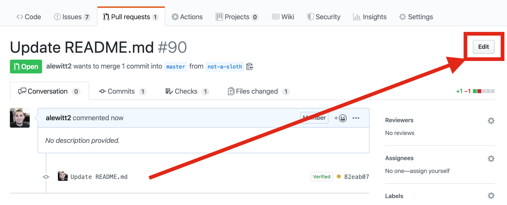

# commit-message status check

## Background

`razee-github-bot`'s commit message check ensures that all pull requests which get
merged into `master` have a valid commit message, based on [Razee's commit message guidelines](https://github.com/razee-io/Razee/blob/master/commit-message-guidelines.md).

The Razee team uses GitHub's "Squash and Merge" feature to merge pull requests.
When using this feature, the default commit message for the squashed commit is
determined as follows:

- If the pull request contains exactly one commit, that commit message is also
used as the merge commit message.
- If the pull request contains more than one commit, the title of the pull
request is used as the merge commit message.

To minimize the risk of an incorrect commit message getting merged into `master`,
`razee-github-bot` uses the same logic when evaluating a pull request; it checks
the *commit message* if a pull request contains exactly one commit, and it checks
the *title* if a pull request contains more than one commit.

## How do I fix it?

If this status check is failing on your pull request, you should first check what
message the bot is referring to, by looking at the description next to the status
check.

* If the description says "*Commit message* doesn't follow guidelines", you should
amend your commit message from the command line to conform to [Razee's commit message guidelines](https://github.com/razee-io/Razee/blob/master/commit-message-guidelines.md).
(This description will be used if your pull request has exactly one commit.)

    ```bash
    git pull origin
    git commit --amend
    git push --force
    ```

* If the description says "*PR title* doesn't follow commit message guidelines",
you should fix your pull request title on github.com to conform to [Razee's commit message guidelines](https://github.com/razee-io/Razee/blob/master/commit-message-guidelines.md).
(This description will be used if your pull request has more than one commit.)

    
